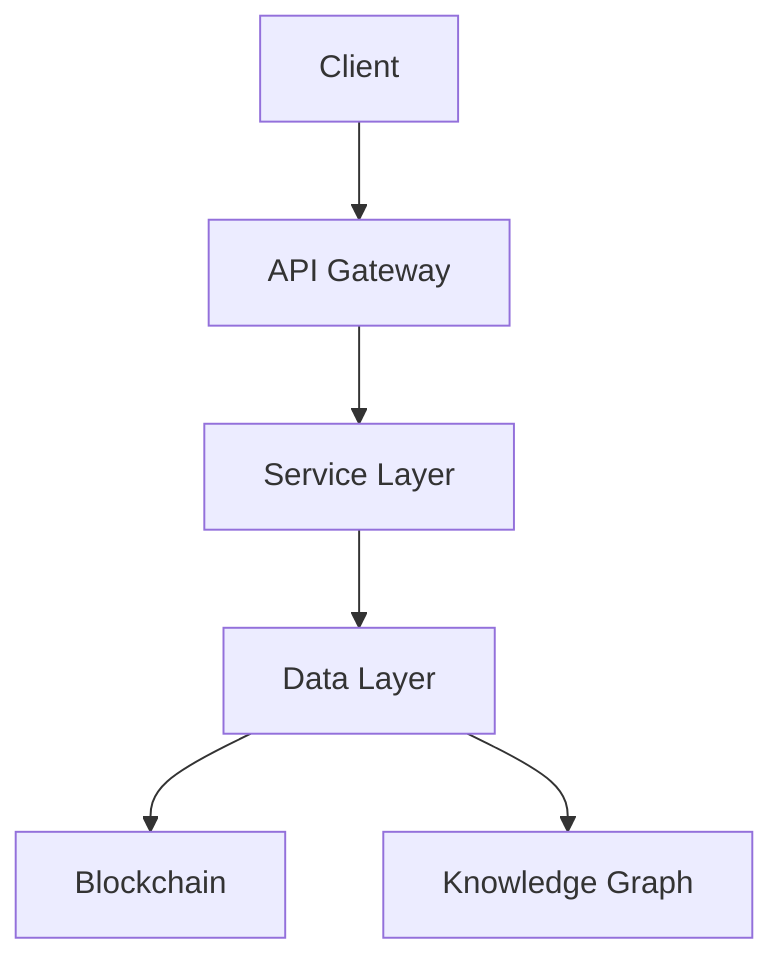
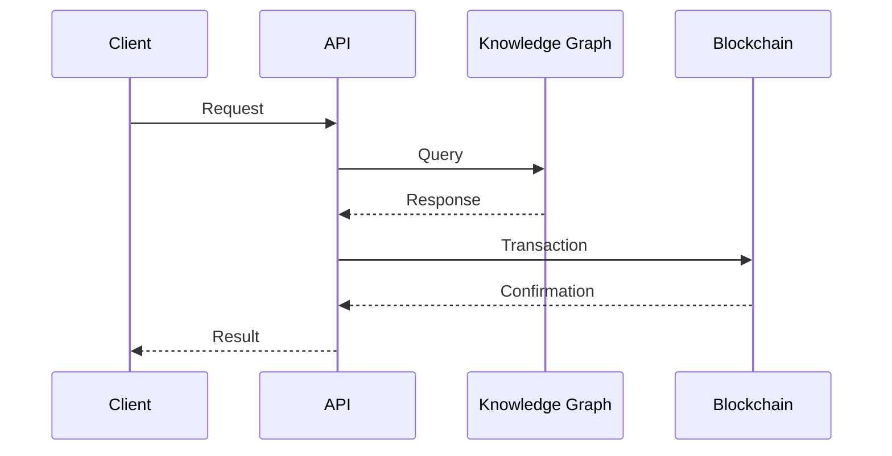

# Architecture Documentation
---
breadcrumb: [Home](../README.md) > [Technical Documentation](../technical/README.md) > [Architecture](../technical/architecture/README.md)
---
This directory contains comprehensive architecture documentation for the SafeAI platform, including system design, infrastructure, and integration guides.

## Directory Structure
      
      
### System Architecture
- [System Overview](system-overview.md)
- [Component Architecture](component-architecture.md)
- [Data Flow](data-flow.md)
- [Deployment Architecture](deployment-architecture.md)
      
      
### Blockchain Integration
- [Blockchain Overview](blockchain-integration.md)
- [Smart Contracts](smart-contracts.md)
- [Token Economics](token-economics.md)
- [Security Model](security-model.md)
      
      
### Knowledge Graph
- [Knowledge Graph Architecture](knowledge-graph-architecture.md)
- [Data Model](data-model.md)
- [Query Patterns](query-patterns.md)
- [Performance Optimization](performance-optimization.md)
      
      
### Infrastructure
- [Cloud Architecture](cloud-architecture.md)
- [Networking](networking.md)
- [Security](security.md)
- [Monitoring](monitoring.md)
      
      
## Getting Started
      
      
### For Architects
1. Review the [System Overview](system-overview.md)
2. Study the [Component Architecture](component-architecture.md)
3. Understand the [Data Flow](data-flow.md)
      
      
### For Developers
1. Read the [Blockchain Integration](blockchain-integration.md)
2. Review the [Knowledge Graph Architecture](knowledge-graph-architecture.md)
3. Check the [Infrastructure Guide](cloud-architecture.md)
      
      
### For DevOps
1. Study the [Deployment Architecture](deployment-architecture.md)
2. Review the [Networking Guide](networking.md)
3. Understand the [Monitoring Setup](monitoring.md)
      
      
## Architecture Standards
      
      
### Design Principles
- Scalability
- Reliability
- Security
- Maintainability
      
      
### Technology Stack
- Frontend: React, TypeScript
- Backend: Python, FastAPI
- Database: Neo4j
- Blockchain: Ethereum
- Cloud: AWS, GCP
      
      
### Security Architecture
- Authentication
- Authorization
- Encryption
- Compliance
      
      
## Diagrams
      
      
### System Architecture

      
      
### Data Flow

      
      
## Best Practices
      
      
### Design Patterns
- Microservices
- Event-Driven
- CQRS
- Event Sourcing
      
      
### Performance
- Caching
- Load Balancing
- Database Optimization
- Query Optimization
      
      
### Security
- Defense in Depth
- Least Privilege
- Zero Trust
- Compliance
      
      
## Support
      
      
### Architecture Support
- Join the [Architecture Discord](https://discord.gg/safeai-arch)
- Contact arch@safeai.com
- Review [Architecture Decisions](architecture-decisions.md)
      
      
### Documentation Issues
- Report issues on GitHub
- Suggest improvements via pull requests
- Contact docs@safeai.com
      
      
---
*Last updated: March 2024*
Copyright © 2024 SafeAI. All rights reserved. 