# SafeAI Agent Workshop Guide



## Introduction

The SafeAI Agent Workshop is a powerful visual interface for creating, configuring, and managing intelligent agents within the Agentic Knowledge Graph ecosystem. This comprehensive guide will walk you through every aspect of the Agent Workshop, with step-by-step instructions suitable for users new to the SafeAI platform.

## What Are Agentic Knowledge Graphs?

Before diving into the Agent Workshop, it's helpful to understand what Agentic Knowledge Graphs (KGs) are:

An Agentic Knowledge Graph is a specialized graph database that:
- Stores structured knowledge about a specific domain
- Defines relationships between different concepts
- Provides reasoning capabilities through AI agents
- Ensures ethical and secure use of information

SafeAI agents leverage these knowledge graphs to perform complex tasks while maintaining security, transparency, and ethical compliance.

## Accessing the Agent Workshop

To access the Agent Workshop:

1. Log in to the SafeAI Management Console
2. Connect your wallet by clicking the "Connect Wallet" button in the upper right corner
3. From the main navigation sidebar, click on "Agent Workshop"

## Agent Workshop Interface Overview

The Agent Workshop interface consists of several key areas:


1. **Template Gallery** - Pre-configured agent templates for various use cases
2. **Agent Editor** - Visual interface for configuring agent properties
3. **Capability Manager** - Add and configure agent capabilities
4. **Security Controls** - Set permission and access controls
5. **Testing Environment** - Test agent behavior before deployment
6. **Deployment Controls** - Deploy agents to production environments

## Creating Your First Agent

### Step 1: Select a Template

The Template Gallery provides pre-configured starting points for various agent types:



1. Click on the "New Agent" button in the upper right corner
2. Browse the template gallery by category or use the search function
3. Hover over a template to view its description and capabilities
4. Click on a template card to select it
5. Click "Use Template" to start with the selected configuration

**Available Template Categories:**
- Data Processing Agents
- Security Monitoring Agents
- Knowledge Query Agents
- Creative Agents
- Mathematical Reasoning Agents
- Ethical Compliance Agents

### Step 2: Configure Basic Properties

The Agent Editor allows you to set fundamental properties for your agent:

1. **Name** - Enter a descriptive name for your agent
2. **Description** - Provide a detailed explanation of the agent's purpose
3. **Version** - Set the agent version (defaults to 1.0.0)
4. **Tags** - Add tags to categorize your agent
5. **Icon** - Select or upload an icon for easier identification
6. **Knowledge Graphs** - Select which knowledge graphs the agent can access

Click "Next" to proceed to capability configuration.

### Step 3: Configure Capabilities

The Capability Manager allows you to add, remove, and configure agent capabilities:



1. Browse available capabilities in the left panel
2. Click the "+" button to add a capability to your agent
3. Configure capability parameters in the right panel
4. Set input/output schemas for each capability
5. Define capability constraints and requirements

**Core Capability Categories:**
- **Data Access** - Knowledge graph query capabilities
- **Reasoning** - Logical reasoning and inference
- **Communication** - Interaction with users and other agents
- **Integration** - External system connections
- **Security** - Threat detection and protection
- **Compliance** - Ethical and regulatory oversight

Click "Next" to proceed to security controls.

### Step 4: Set Security Controls

The Security Controls section allows you to define access permissions and operational constraints:



1. **Access Control** - Define who can use or modify the agent
2. **Resource Limits** - Set maximum resource usage (CPU, memory, etc.)
3. **Rate Limiting** - Configure request rate limitations
4. **Data Handling** - Set data access and retention policies
5. **Audit Settings** - Configure logging and monitoring
6. **Blockchain Verification** - Enable or disable blockchain-based verification

Click "Next" to proceed to testing.

### Step 5: Test Your Agent

The Testing Environment allows you to validate your agent's behavior before deployment:

1. Select a test scenario from the dropdown or create a custom test
2. Enter test inputs in the provided fields
3. Click "Run Test" to execute the test
4. View results in the output panel
5. Check for warnings or errors in the validation panel
6. Make adjustments to your agent configuration as needed

Click "Next" when you're satisfied with the test results.

### Step 6: Deploy Your Agent

The Deployment Controls allow you to make your agent available for use:

1. **Environment** - Select where to deploy (Development, Staging, Production)
2. **Scaling** - Configure auto-scaling settings
3. **Monitoring** - Set up performance and health monitoring
4. **Notifications** - Configure alert notifications
5. **Backup Strategy** - Set automated backup preferences
6. **Blockchain Configuration** - Configure licensing and transaction settings

Click "Deploy" to complete the process.

## Agent Management

Once you've created agents, you can manage them through the Agent Browser:

The Agent Browser provides:
- List of all your agents with status indicators
- Search and filter functions
- Quick actions for common operations
- Detailed performance metrics
- Version history and rollback options

### Common Management Tasks

#### Editing an Existing Agent

1. Find the agent in the Agent Browser
2. Click the "Edit" button (pencil icon)
3. Make your changes in the Agent Editor
4. Click "Save" to update the agent

#### Duplicating an Agent

1. Find the agent in the Agent Browser
2. Click the "Duplicate" button (copy icon)
3. Provide a new name for the duplicate
4. Click "Create" to make a copy

#### Monitoring Agent Performance

1. Find the agent in the Agent Browser
2. Click the "Metrics" button (chart icon)
3. View performance data in the metrics dashboard
4. Set alerts for performance thresholds

## Advanced Features

### Natural Language Agent Creation

For users who prefer a more conversational approach, SafeAI supports creating agents using natural language descriptions:

1. Click "Create with Description" in the Agent Workshop
2. Enter a detailed description of what you want the agent to do
3. The system will generate a complete agent configuration
4. Review and adjust the generated configuration
5. Proceed with testing and deployment

Example description:
```
Create an agent that analyzes financial transaction data to detect fraudulent patterns. It should check for unusual transaction amounts, frequencies, and locations. The agent should flag suspicious transactions for review and generate detailed reports. It needs access to the financial knowledge graph and should operate with high security and privacy standards.
```

### Agent Collaboration

SafeAI agents can work together to solve complex problems. To configure agent collaboration:



1. Navigate to the "Collaboration" tab in the Agent Editor
2. Select other agents this agent can communicate with
3. Define communication protocols and data sharing rules
4. Set up coordination patterns (hierarchical, peer-to-peer, etc.)
5. Configure security measures for inter-agent communication

### Custom Capability Development

Advanced users can create custom capabilities for specialized functionality:

1. Navigate to the "Developer" section in the main menu
2. Select "Custom Capabilities"
3. Click "Create New Capability"
4. Define inputs, outputs, and processing logic
5. Test your capability in isolation
6. Make the capability available to your agents

## Ethical Guidelines

SafeAI emphasizes ethical AI development. The Agent Workshop includes several features to ensure ethical operation:

- **Ethical Framework Selection** - Choose from predefined ethical frameworks
- **Constraint Definition** - Set explicit ethical constraints
- **Bias Detection** - Automated detection of potential biases
- **Fairness Metrics** - Monitor fairness across different groups
- **Explainability Controls** - Configure explanation generation
- **Human Oversight** - Define when human review is required

## Blockchain Integration

SafeAI agents can leverage blockchain technology for transparent and secure operation:

1. Navigate to the "Blockchain" tab in the Agent Editor
2. Configure SafeAI Coin integration for:
   - Transaction fees
   - Licensing verification
   - Audit trail generation
   - Governance participation
3. Set up smart contract interaction parameters
4. Configure on-chain verification requirements

## Troubleshooting

### Common Issues and Solutions

#### Agent Creation Failures

**Issue**: Agent fails to create with "Invalid configuration" error  
**Solution**: Check that all required fields are completed and valid

#### Deployment Errors

**Issue**: Agent fails to deploy with resource error  
**Solution**: Reduce resource requirements or increase your resource allocation

#### Performance Problems

**Issue**: Agent responds slowly or times out  
**Solution**: Optimize queries, reduce complexity, or increase resource allocation

#### Security Warnings

**Issue**: Agent shows security vulnerability warnings  
**Solution**: Review and adjust permission settings and access controls

## Best Practices

### Designing Effective Agents

1. **Start Simple** - Begin with focused agents that do one thing well
2. **Iterative Development** - Build, test, improve in small increments
3. **Clear Purpose** - Define a clear, specific purpose for each agent
4. **Appropriate Access** - Grant only necessary knowledge graph access
5. **Thorough Testing** - Test with diverse inputs and edge cases
6. **Resource Efficiency** - Optimize for efficient resource usage
7. **Security First** - Always prioritize security considerations
8. **Ethical Guidelines** - Include explicit ethical constraints

### Maintaining Agents

1. **Regular Updates** - Keep agents updated with the latest knowledge
2. **Performance Monitoring** - Regularly review performance metrics
3. **Security Audits** - Conduct periodic security reviews
4. **User Feedback** - Collect and incorporate user feedback
5. **Version Control** - Maintain clear versioning for all changes

## Resources

- [Video Tutorial: Creating Your First Agent](https://safeAIcoin.com/tutorials/first-agent)
- [SafeAI Knowledge Base](https://safeAIcoin.com/knowledge-base)
- [Community Templates](https://community.safeAIcoin.com/templates)
- [API Documentation](https://docs.safeAIcoin.com/api/agent-workshop)

---
*Last updated: March 2024*
Copyright © 2024 SafeAI. All rights reserved. 