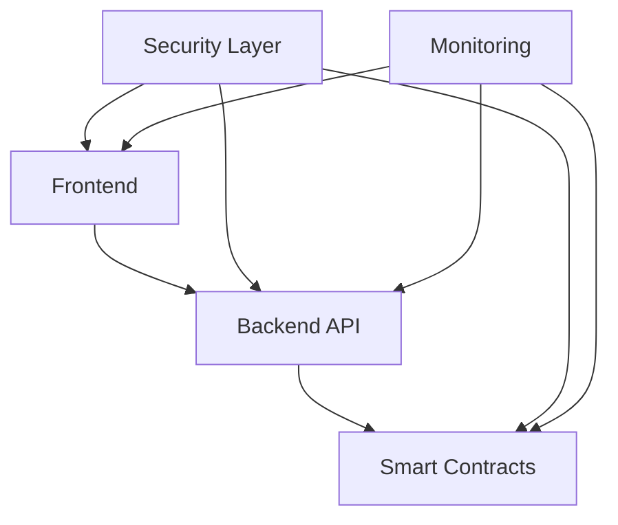

# SafeAI IPTO Technical Architecture
This document outlines the technical architecture of the SafeAI Initial Public Token Offering (IPTO) platform.
## Table of Contents
1. [Overview](#overview)
2. [System Architecture](#system-architecture)
3. [Smart Contracts](#smart-contracts)
4. [Frontend](#frontend)
5. [Backend](#backend)
6. [Security](#security)
7. [Infrastructure](#infrastructure)
8. [Monitoring](#monitoring)
## Overview
The SafeAI IPTO platform is built on a modern, scalable architecture that ensures security, reliability, and performance.
### Key Components
- Smart Contracts (Ethereum)
- Frontend Application (React)
- Backend Services (Node.js)
- Security Layer
- Monitoring System
## System Architecture
### High-Level Architecture

### Component Interaction
1. **Frontend-Backend**
   - RESTful API
   - WebSocket connections
   - Real-time updates
   - Error handling
2. **Backend-Blockchain**
   - Web3 integration
   - Contract interaction
   - Transaction management
   - Event listening
3. **Security Layer**
   - Authentication
   - Authorization
   - Rate limiting
   - DDoS protection
## Smart Contracts
### Contract Structure
1. **Token Contract**
   ```solidity
   contract SafeToken is ERC20, AccessControl {
       // Token implementation
   }
   ```
2. **Sale Contract**
   ```solidity
   contract IPTOSale is ReentrancyGuard, AccessControl {
       // Sale implementation
   }
   ```
3. **Governance Contract**
   ```solidity
   contract Governance is AccessControl {
       // Governance implementation
   }
   ```
### Contract Features
1. **Security**
   - Access control
   - Reentrancy protection
   - Overflow protection
   - Emergency stops
2. **Functionality**
   - Token management
   - Sale mechanics
   - Governance system
   - Vesting schedules
## Frontend
### Technology Stack
1. **Core Technologies**
   - React
   - TypeScript
   - Web3.js
   - Material-UI
2. **State Management**
   - Redux
   - Web3 Context
   - Local Storage
   - Session Management
### Components
1. **User Interface**
   - Dashboard
   - Investment Form
   - Wallet Integration
   - Transaction History
2. **Features**
   - Real-time updates
   - Transaction tracking
   - Portfolio management
   - Governance interface
## Backend
### Technology Stack
1. **Core Technologies**
   - Node.js
   - Express
   - TypeScript
   - MongoDB
2. **Services**
   - Authentication
   - KYC/AML
   - Transaction Processing
   - Event Management
### API Structure
1. **Endpoints**
   - User Management
   - Investment Processing
   - Transaction History
   - Governance Actions
2. **WebSocket Events**
   - Price Updates
   - Transaction Status
   - System Events
   - Notifications
## Security
### Security Measures
1. **Authentication**
   - JWT tokens
   - 2FA support
   - Session management
   - IP whitelisting
2. **Authorization**
   - Role-based access
   - Permission system
   - API security
   - Contract security
### Protection Mechanisms
1. **DDoS Protection**
   - Rate limiting
   - Traffic filtering
   - Load balancing
   - CDN integration
2. **Data Protection**
   - Encryption
   - Secure storage
   - Data backup
   - Access control
## Infrastructure
### Cloud Infrastructure
1. **Hosting**
   - AWS/GCP
   - Containerization
   - Auto-scaling
   - Load balancing
2. **Database**
   - MongoDB Atlas
   - Redis Cache
   - Backup system
   - Replication
### Deployment
1. **CI/CD**
   - GitHub Actions
   - Docker
   - Kubernetes
   - Monitoring
2. **Environment**
   - Development
   - Staging
   - Production
   - Testing
## Monitoring
### Monitoring Systems
1. **Application Monitoring**
   - Performance metrics
   - Error tracking
   - User analytics
   - System health
2. **Blockchain Monitoring**
   - Contract events
   - Transaction tracking
   - Gas usage
   - Network status
### Alerting
1. **Alerts**
   - System alerts
   - Security alerts
   - Performance alerts
   - Error alerts
2. **Notifications**
   - Email notifications
   - Slack integration
   - SMS alerts
   - Dashboard updates
## Contact Information
### Technical Team
```
Lead Architect: architect@safeai.com
Frontend Lead: frontend@safeai.com
Backend Lead: backend@safeai.com
DevOps Lead: devops@safeai.com
```
### Support
```
Technical Support: support@safeai.com
Security Team: security@safeai.com
Operations Team: ops@safeai.com
```
---
© 2024 SafeAI. All rights reserved. 