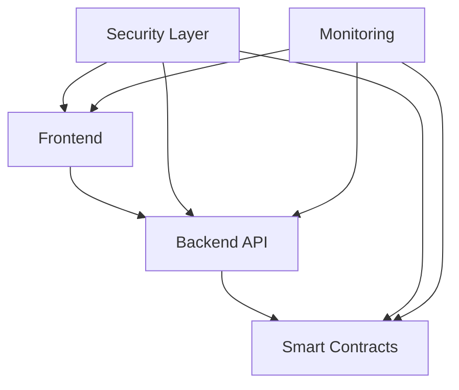

# SafeAI System Architecture

## Overview
SafeAI is built on a robust, scalable architecture that combines blockchain technology with advanced AI capabilities. This document outlines the system's architecture, components, and their interactions.

## System Components

### Core Architecture


The SafeAI platform consists of several key components:

1. **Frontend Layer**
   - React-based web interface
   - TypeScript for type safety
   - Redux for state management
   - Web3 integration for blockchain interaction

2. **Backend Services**
   - Node.js API server
   - Python AI services
   - GraphQL API for flexible data querying
   - WebSocket support for real-time updates

3. **Blockchain Layer**
   - Ethereum-based smart contracts
   - IPFS for decentralized storage
   - Token management system
   - Consensus mechanisms

4. **AI Layer**
   - Agent management system
   - Knowledge graph engine
   - Theorem proving engine
   - Natural language processing

### Data Flow


The system follows a clear data flow pattern:

1. **User Interactions**
   - Frontend captures user input
   - Validates and processes requests
   - Manages state updates

2. **Service Layer**
   - Handles business logic
   - Manages data persistence
   - Coordinates between components

3. **Blockchain Operations**
   - Processes transactions
   - Manages smart contracts
   - Handles token operations

4. **AI Processing**
   - Executes agent operations
   - Processes knowledge graphs
   - Manages theorem proving

### Security Architecture


Security is implemented at multiple levels:

1. **Authentication & Authorization**
   - JWT-based authentication
   - Role-based access control
   - Multi-factor authentication

2. **Data Protection**
   - End-to-end encryption
   - Secure key management
   - Data validation

3. **Network Security**
   - TLS encryption
   - DDoS protection
   - Rate limiting

4. **Smart Contract Security**
   - Formal verification
   - Audit logging
   - Access controls

### Deployment Architecture


The system is deployed across multiple environments:

1. **Development**
   - Local development setup
   - Testing environment
   - CI/CD pipeline

2. **Staging**
   - Integration testing
   - Performance testing
   - Security testing

3. **Production**
   - High availability setup
   - Load balancing
   - Monitoring and logging

## Component Details

### Frontend Architecture
```typescript
// Example component structure
interface FrontendProps {
  // Component properties
}

const FrontendComponent: React.FC<FrontendProps> = (props) => {
  // Implementation
};
```

### Backend Architecture
```typescript
// Example service structure
class BackendService {
  // Service methods
  async processRequest() {
    // Implementation
  }
}
```

### Blockchain Integration
```solidity
// Example smart contract
contract SafeAIContract {
    // Contract methods
    function processTransaction() public {
        // Implementation
    }
}
```

### AI Service Architecture
```python
# Example AI service
class AIService:
    def process_request(self):
        # Implementation
        pass
```

## Best Practices

1. **Code Organization**
   - Modular architecture
   - Clear separation of concerns
   - Consistent coding standards

2. **Performance**
   - Efficient data structures
   - Caching strategies
   - Load balancing

3. **Security**
   - Regular security audits
   - Vulnerability scanning
   - Access control

4. **Scalability**
   - Horizontal scaling
   - Database optimization
   - Resource management

## Monitoring and Maintenance

1. **System Monitoring**
   - Performance metrics
   - Error tracking
   - Resource usage

2. **Maintenance Procedures**
   - Regular updates
   - Backup procedures
   - Disaster recovery

3. **Deployment Process**
   - Version control
   - Automated testing
   - Rollback procedures

## Next Steps

1. Review the [API Documentation](../api/README.md)
2. Check the [Security Guidelines](../security/README.md)
3. Explore the [Development Guide](../development/README.md)

# SafeAI IPTO Technical Architecture
---
breadcrumb: [Home](../README.md) > [Technical Documentation](../technical/README.md) > [Architecture](../technical/architecture/README.md) > [Technical Architecture](../technical/architecture/architecture.md)
---
This document outlines the technical architecture of the SafeAI Initial Public Token Offering (IPTO) platform.
## Table of Contents
1. [Overview](#overview)
2. [System Architecture](#system-architecture)
3. [Smart Contracts](#smart-contracts)
4. [Frontend](#frontend)
5. [Backend](#backend)
6. [Security](#security)
7. [Infrastructure](#infrastructure)
8. [Monitoring](#monitoring)
## Overview
The SafeAI IPTO platform is built on a modern, scalable architecture that ensures security, reliability, and performance.
### Key Components
- Smart Contracts (Ethereum)
- Frontend Application (React)
- Backend Services (Node.js)
- Security Layer
- Monitoring System
## System Architecture
### High-Level Architecture

### Component Interaction
1. **Frontend-Backend**
   - RESTful API
   - WebSocket connections
   - Real-time updates
   - Error handling
2. **Backend-Blockchain**
   - Web3 integration
   - Contract interaction
   - Transaction management
   - Event listening
3. **Security Layer**
   - Authentication
   - Authorization
   - Rate limiting
   - DDoS protection
## Smart Contracts
### Contract Structure
1. **Token Contract**
   ```solidity
   contract SafeToken is ERC20, AccessControl {
       // Token implementation
   }
   ```
2. **Sale Contract**
   ```solidity
   contract IPTOSale is ReentrancyGuard, AccessControl {
       // Sale implementation
   }
   ```
3. **Governance Contract**
   ```solidity
   contract Governance is AccessControl {
       // Governance implementation
   }
   ```
### Contract Features
1. **Security**
   - Access control
   - Reentrancy protection
   - Overflow protection
   - Emergency stops
2. **Functionality**
   - Token management
   - Sale mechanics
   - Governance system
   - Vesting schedules
## Frontend
### Technology Stack
1. **Core Technologies**
   - React
   - TypeScript
   - Web3.js
   - Material-UI
2. **State Management**
   - Redux
   - Web3 Context
   - Local Storage
   - Session Management
### Components
1. **User Interface**
   - Dashboard
   - Investment Form
   - Wallet Integration
   - Transaction History
2. **Features**
   - Real-time updates
   - Transaction tracking
   - Portfolio management
   - Governance interface
## Backend
### Technology Stack
1. **Core Technologies**
   - Node.js
   - Express
   - TypeScript
   - MongoDB
2. **Services**
   - Authentication
   - KYC/AML
   - Transaction Processing
   - Event Management
### API Structure
1. **Endpoints**
   - User Management
   - Investment Processing
   - Transaction History
   - Governance Actions
2. **WebSocket Events**
   - Price Updates
   - Transaction Status
   - System Events
   - Notifications
## Security
### Security Measures
1. **Authentication**
   - JWT tokens
   - 2FA support
   - Session management
   - IP whitelisting
2. **Authorization**
   - Role-based access
   - Permission system
   - API security
   - Contract security
### Protection Mechanisms
1. **DDoS Protection**
   - Rate limiting
   - Traffic filtering
   - Load balancing
   - CDN integration
2. **Data Protection**
   - Encryption
   - Secure storage
   - Data backup
   - Access control
## Infrastructure
### Cloud Infrastructure
1. **Hosting**
   - AWS/GCP
   - Containerization
   - Auto-scaling
   - Load balancing
2. **Database**
   - MongoDB Atlas
   - Redis Cache
   - Backup system
   - Replication
### Deployment
1. **CI/CD**
   - GitHub Actions
   - Docker
   - Kubernetes
   - Monitoring
2. **Environment**
   - Development
   - Staging
   - Production
   - Testing
## Monitoring
### Monitoring Systems
1. **Application Monitoring**
   - Performance metrics
   - Error tracking
   - User analytics
   - System health
2. **Blockchain Monitoring**
   - Contract events
   - Transaction tracking
   - Gas usage
   - Network status
### Alerting
1. **Alerts**
   - System alerts
   - Security alerts
   - Performance alerts
   - Error alerts
2. **Notifications**
   - Email notifications
   - Slack integration
   - SMS alerts
   - Dashboard updates
## Contact Information
### Technical Team
```
Lead Architect: architect@safeai.com
Frontend Lead: frontend@safeai.com
Backend Lead: backend@safeai.com
DevOps Lead: devops@safeai.com
```
### Support
```
Technical Support: support@safeai.com
Security Team: security@safeai.com
Operations Team: ops@safeai.com
```
---
© 2024 SafeAI. All rights reserved. 