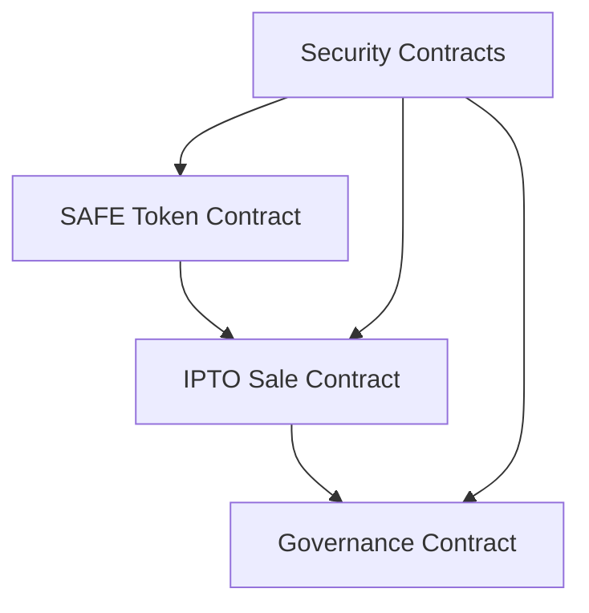

# SafeAI IPTO Technical Implementation Guide
---
breadcrumb: [Home](../README.md) > [Technical Documentation](../technical/README.md) > [Development](../technical/development/README.md) > [Implementation Guide](../technical/development/implementation-guide.md)
---
This document provides detailed technical specifications and implementation guidelines for the SafeAI IPTO smart contracts.
## Table of Contents
1. [Overview](#overview)
2. [Architecture](#architecture)
3. [Contract Specifications](#contract-specifications)
4. [Implementation Details](#implementation-details)
5. [Integration Guide](#integration-guide)
6. [Testing Guide](#testing-guide)
7. [Deployment Guide](#deployment-guide)
## Overview
This guide outlines the technical implementation of the SafeAI IPTO smart contracts, including architecture, specifications, and deployment procedures.
### Key Components
- SAFE Token Contract
- IPTO Sale Contract
- Governance Contract
- Security Contracts
## Architecture
### System Architecture

### Contract Dependencies
1. **OpenZeppelin Contracts**
   - ERC20
   - AccessControl
   - SafeMath
   - ReentrancyGuard
2. **Custom Contracts**
   - VestingSchedule
   - TokenDistribution
   - SaleMechanism
   - GovernanceSystem
## Contract Specifications
### SAFE Token Contract
```solidity
// SPDX-License-Identifier: MIT
pragma solidity ^0.8.0;

import "@openzeppelin/contracts/token/ERC20/ERC20.sol";
import "@openzeppelin/contracts/access/AccessControl.sol";

contract SafeToken is ERC20, AccessControl {
    bytes32 public constant MINTER_ROLE = keccak256("MINTER_ROLE");
    
    constructor() ERC20("SafeAI Token", "SAFE") {
        _setupRole(DEFAULT_ADMIN_ROLE, msg.sender);
        _setupRole(MINTER_ROLE, msg.sender);
    }
    
    function mint(address to, uint256 amount) public onlyRole(MINTER_ROLE) {
        _mint(to, amount);
    }
    
    function burn(uint256 amount) public {
        _burn(msg.sender, amount);
    }
}
```
### IPTO Sale Contract
```solidity
// SPDX-License-Identifier: MIT
pragma solidity ^0.8.0;

import "@openzeppelin/contracts/security/ReentrancyGuard.sol";
import "@openzeppelin/contracts/access/AccessControl.sol";
import "./SafeToken.sol";

contract IPTOSale is ReentrancyGuard, AccessControl {
    SafeToken public token;
    uint256 public salePrice;
    uint256 public saleStart;
    uint256 public saleEnd;
    
    constructor(address _token) {
        token = SafeToken(_token);
        _setupRole(DEFAULT_ADMIN_ROLE, msg.sender);
    }
    
    function startSale(uint256 _price, uint256 _duration) external onlyRole(DEFAULT_ADMIN_ROLE) {
        salePrice = _price;
        saleStart = block.timestamp;
        saleEnd = saleStart + _duration;
    }
    
    function purchaseTokens() external payable nonReentrant {
        require(block.timestamp >= saleStart && block.timestamp <= saleEnd, "Sale not active");
        uint256 tokenAmount = msg.value / salePrice;
        token.mint(msg.sender, tokenAmount);
    }
}
```
## Implementation Details
### Token Distribution
1. **Initial Supply**
   - Total: 1,000,000,000 SAFE
   - IPTO: 300,000,000 SAFE (30%)
   - Team: 200,000,000 SAFE (20%)
   - Development: 200,000,000 SAFE (20%)
   - Marketing: 150,000,000 SAFE (15%)
   - Reserve: 150,000,000 SAFE (15%)
### Vesting Schedule
```solidity
contract VestingSchedule {
    struct Vesting {
        uint256 amount;
        uint256 startTime;
        uint256 duration;
        uint256 released;
    }
    
    mapping(address => Vesting) public vestings;
    
    function createVesting(address beneficiary, uint256 amount, uint256 duration) external {
        vestings[beneficiary] = Vesting({
            amount: amount,
            startTime: block.timestamp,
            duration: duration,
            released: 0
        });
    }
    
    function release(address beneficiary) external {
        Vesting storage vesting = vestings[beneficiary];
        uint256 releasable = calculateReleasable(vesting);
        vesting.released += releasable;
        token.transfer(beneficiary, releasable);
    }
}
```
### Governance System
```solidity
contract Governance {
    struct Proposal {
        uint256 id;
        address proposer;
        string description;
        uint256 startTime;
        uint256 endTime;
        uint256 forVotes;
        uint256 againstVotes;
        bool executed;
    }
    
    mapping(uint256 => Proposal) public proposals;
    uint256 public proposalCount;
    
    function createProposal(string memory description) external returns (uint256) {
        uint256 proposalId = proposalCount++;
        proposals[proposalId] = Proposal({
            id: proposalId,
            proposer: msg.sender,
            description: description,
            startTime: block.timestamp,
            endTime: block.timestamp + 3 days,
            forVotes: 0,
            againstVotes: 0,
            executed: false
        });
        return proposalId;
    }
}
```
## Integration Guide
### Setup Requirements
1. **Development Environment**
   - Node.js v14+
   - Truffle/Hardhat
   - Solidity v0.8.0+
   - Web3.js/Ethers.js
2. **Dependencies**
   - OpenZeppelin Contracts
   - Testing Frameworks
   - Deployment Tools
### Integration Steps
1. **Contract Deployment**
   ```javascript
   // Deploy SAFE Token
   const SafeToken = await ethers.getContractFactory("SafeToken");
   const token = await SafeToken.deploy();
   await token.deployed();
   
   // Deploy IPTO Sale
   const IPTOSale = await ethers.getContractFactory("IPTOSale");
   const sale = await IPTOSale.deploy(token.address);
   await sale.deployed();
   ```
2. **Contract Interaction**
   ```javascript
   // Purchase tokens
   await sale.purchaseTokens({ value: ethers.utils.parseEther("1.0") });
   
   // Check balance
   const balance = await token.balanceOf(userAddress);
   ```
## Testing Guide
### Test Environment
1. **Local Network**
   - Ganache
   - Hardhat Network
   - Test Accounts
2. **Test Data**
   - Sample Users
   - Test Transactions
   - Edge Cases
### Test Cases
```javascript
describe("IPTOSale", function() {
    it("Should allow token purchase", async function() {
        await sale.purchaseTokens({ value: ethers.utils.parseEther("1.0") });
        const balance = await token.balanceOf(userAddress);
        expect(balance).to.be.gt(0);
    });
    
    it("Should respect sale period", async function() {
        await expect(sale.purchaseTokens({ value: ethers.utils.parseEther("1.0") }))
            .to.be.revertedWith("Sale not active");
    });
});
```
## Deployment Guide
### Deployment Process
1. **Preparation**
   - Contract verification
   - Gas estimation
   - Network selection
   - Account setup
2. **Deployment Steps**
   ```bash
   # Compile contracts
   npx hardhat compile
   
   # Deploy to network
   npx hardhat run scripts/deploy.js --network mainnet
   ```
### Post-Deployment
1. **Verification**
   - Contract verification
   - Function testing
   - State verification
   - Event monitoring
2. **Monitoring**
   - Transaction monitoring
   - Event tracking
   - State changes
   - Error detection
## Contact Information
### Technical Support
```
Email: tech@safeai.com
Phone: [Phone Number]
Address: [Physical Address]
```
### Development Team
```
Lead Developer: dev@safeai.com
Security Team: security@safeai.com
Operations Team: ops@safeai.com
```
---
© 2024 SafeAI. All rights reserved. 