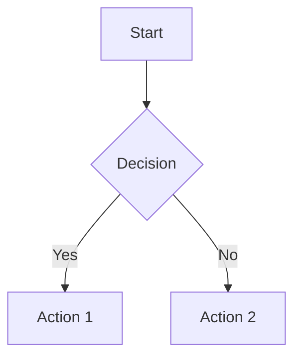

# Contributing to SafeAI Documentation
This guide explains how to contribute to the SafeAI documentation.
## Table of Contents
1. [Getting Started](#getting-started)
2. [Documentation Structure](#documentation-structure)
3. [Writing Guidelines](#writing-guidelines)
4. [Markdown Style](#markdown-style)
5. [Images and Media](#images-and-media)
6. [Code Examples](#code-examples)
7. [Review Process](#review-process)
8. [Resources](#resources)
## Getting Started
### Prerequisites
- Git
- Markdown editor
- Basic understanding of SafeAI platform
### Setup
1. Fork the [SafeAI Documentation repository](https://github.com/safeai/docs)
2. Clone your fork:
```bash
git clone https://github.com/YOUR_USERNAME/docs.git
cd docs
```
3. Create a new branch:
```bash
git checkout -b docs/your-feature-name
```
## Documentation Structure
### Directory Layout
```
docs/
├── getting-started.md
├── basic-concepts.md
├── user-manual.md
├── technical/
│   ├── api-reference.md
│   ├── sdk-documentation.md
│   └── contributing-guide.md
├── gui/
│   ├── management-console.md
│   └── agent-workshop.md
└── domains/
    ├── ethics-kg-guide.md
    └── math-kg-guide.md
```
### File Naming
- Use kebab-case for filenames
- Include descriptive names
- Group related content
- Use appropriate extensions (.md)
## Writing Guidelines
### Content Structure
1. Start with a clear title
2. Include a table of contents
3. Use appropriate heading levels
4. Break content into sections
5. End with next steps or resources
### Writing Style
1. Be clear and concise
2. Use active voice
3. Write for your audience
4. Include examples
5. Keep paragraphs short
### Example Structure
```markdown
# Feature Guide

## Table of Contents
1. [Introduction](#introduction)
2. [Getting Started](#getting-started)
3. [Usage](#usage)
4. [Examples](#examples)
5. [Troubleshooting](#troubleshooting)

## Introduction
Brief overview of the feature...

## Getting Started
Step-by-step instructions...

## Usage
Detailed usage information...

## Examples
Code and usage examples...

## Troubleshooting
Common issues and solutions...

## Next Steps
- Link to related documentation
- Additional resources
```
## Markdown Style
### Headings
```markdown
# Main Title
## Section Title
### Subsection Title
#### Minor Section
```
### Lists
```markdown
- Unordered list item
- Another item
  - Nested item
  - Another nested item

1. Ordered list item
2. Another item
   1. Nested item
   2. Another nested item
```
### Code Blocks
````markdown
```python
def example_function():
    print("Hello, World!")
```
````
### Links
```markdown
[Link text](path/to/file.md)
[External link](https://example.com)
```
### Tables
```markdown
| Header 1 | Header 2 |
|----------|----------|
| Cell 1   | Cell 2   |
| Cell 3   | Cell 4   |
```
## Images and Media
### Image Guidelines
1. Use descriptive filenames
2. Optimize for web
3. Include alt text
4. Place in appropriate directory
### Image Format
```markdown

```
### Diagrams
1. Use Mermaid for diagrams
2. Export as SVG when possible
3. Include source files
### Example Diagram
````markdown

````
## Code Examples
### Code Block Guidelines
1. Specify language
2. Include comments
3. Show complete examples
4. Test all code
### Example Code Block
````markdown
```python
from safeai import SafeAI

# Initialize the SDK
safeai = SafeAI(api_key="your-api-key")

# Create an agent
agent = safeai.agents.create(
    name="My Agent",
    type="general",
    configuration={
        "model": "gpt-4",
        "parameters": {"temperature": 0.7}
    }
)
```
````
## Review Process
### Self-Review
1. Check for typos
2. Verify links
3. Test code examples
4. Review formatting
5. Check accessibility
### Peer Review
1. Submit pull request
2. Address feedback
3. Make requested changes
4. Resolve conflicts
5. Merge when approved
### Review Checklist
- [ ] Content is accurate
- [ ] Structure is clear
- [ ] Examples work
- [ ] Links are valid
- [ ] Images are optimized
- [ ] Formatting is consistent
## Resources
### Documentation Tools
- [Markdown Guide](https://www.markdownguide.org/)
- [Mermaid Documentation](https://mermaid-js.github.io/mermaid/)
- [VS Code Markdown](https://code.visualstudio.com/docs/languages/markdown)
### Style Guides
- [Google Developer Style Guide](https://developers.google.com/tech-writing)
- [Microsoft Style Guide](https://docs.microsoft.com/style-guide/)
### SafeAI Resources
- [Platform Documentation](https://docs.safeAIcoin.com)
- [API Reference](https://docs.safeAIcoin.com/api)
- [Community Forum](https://community.safeAIcoin.com)
## Support
For documentation support:
1. Join our [Documentation Discord](https://discord.gg/safeai-docs)
2. Contact docs@safeAIcoin.com
3. Check our [Documentation FAQ](docs-faq.md)
## License
Documentation contributions are licensed under [CC BY 4.0](https://creativecommons.org/licenses/by/4.0/). 