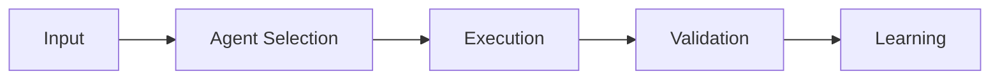

# Agentic Knowledge Graph Architecture

## Overview

The SafeAI Platform's Agentic Knowledge Graph (AKG) represents a revolutionary approach to AI reasoning, combining traditional knowledge graphs with autonomous agents that can learn, adapt, and interact through blockchain-enabled microtransactions.

## Table of Contents

1. [Core Concepts](#core-concepts)
2. [Agent Types](#agent-types)
3. [Knowledge Graph Structure](#knowledge-graph-structure)
4. [Agent Interaction Model](#agent-interaction-model)
5. [Blockchain Integration](#blockchain-integration)
6. [Domain-Specific Implementation](#domain-specific-implementation)

## Core Concepts

### What is an Agentic Knowledge Graph?

An Agentic Knowledge Graph (AKG) is a dynamic knowledge representation system that:
- Stores both knowledge and executable agents
- Enables autonomous reasoning and learning
- Records every transformation step
- Supports blockchain-based microtransactions
- Implements ethical validation
- Learns through language games

### Key Features

1. **Dynamic Agent Loading**
   - Agents are stored as executable code
   - Real-time compilation and execution
   - Performance monitoring and adaptation

2. **Blockchain-Enabled Billing**
   - Pay-per-use model
   - Creator compensation
   - Transparent pricing

3. **Ethical Oversight**
   - Built-in ethical validation
   - Immutable ethical principles
   - Adaptive moral learning

## Agent Types

The AKG supports two primary types of agents:

### 1. Script Agents
```json
{
  "name": "ColorComplement",
  "category": "Color Transformation",
  "agent_type": "Script",
  "agent_code": "def generateCandidate(input) { 
    def candidate = nlQuery('ColorComplement on ' + input.toString()); 
    def cot = 'Inverted colors using x -> 9-x.'; 
    return [candidate: candidate, metadata: [
      method: 'ColorComplement', 
      chain_of_thought: cot, 
      confidence: 0.85
    ]]; 
  }"
}
```

Key characteristics:
- Written in Groovy
- Direct execution
- Deterministic behavior
- High performance
- Specialized transformations

### 2. LLM Agents
```json
{
  "name": "SocraticDialecticAgent",
  "category": "Dialectic Inquiry",
  "agent_type": "LLM",
  "agent_code": "Apply Socratic questioning to the ethical issue '{{input}}', 
    probing underlying assumptions and clarifying moral reasoning."
}
```

Key characteristics:
- Natural language processing
- Adaptive reasoning
- Complex problem solving
- Ethical considerations
- Learning capabilities

## Knowledge Graph Structure

### Base Structure
```json
{
  "domain": "DomainName",
  "description": "Domain description",
  "immutable": false,
  "endpoints": {},
  "agents": [],
  "configuration": {}
}
```

### Agent Definition
```json
{
  "name": "AgentName",
  "category": "Category",
  "usageCount": 0,
  "description": "Agent description",
  "agent_type": "Script|LLM",
  "agent_code": "code or prompt",
  "creatorWallet": "0xWalletAddress",
  "transactionFee": "0.001",
  "approvalCriteria": {
    "effectivenessThreshold": "0.95",
    "ethicsGuidelines": "Guidelines"
  }
}
```

## Agent Interaction Model

### 1. Training Phase


### 2. Execution Flow
1. **Agent Selection**
   - Based on problem type
   - Performance history
   - Cost considerations

2. **Execution**
   - Load agent code
   - Execute transformation
   - Record chain-of-thought

3. **Validation**
   - Ethical compliance
   - Accuracy check
   - Performance metrics

4. **Learning**
   - Update success rates
   - Adapt strategies
   - Refine parameters

## Blockchain Integration

### Transaction Model
```json
{
  "blockchain": {
    "systemWallet": "0xAdminWalletAddress",
    "contractAddress": "0x987654321ABCDEF",
    "pricing": {
      "baseFee": "0.001",
      "dynamicPricing": "Based on supply/demand",
      "minFee": "0.0005",
      "usageQuota": 1000
    }
  }
}
```

### Billing Flow
1. User initiates query
2. System calculates cost
3. Smart contract validates balance
4. Execute transformation
5. Process microtransaction
6. Distribute fees to creators

## Domain-Specific Implementation

### 1. ARC Domain
- Puzzle-solving agents
- Visual transformations
- Pattern recognition
- Composite strategies

Example Agent:
```json
{
  "name": "CompositeTransform",
  "category": "Composite",
  "agent_type": "Script",
  "agent_code": "def generateCandidate(input) {
    def candidate = nlQuery('CompositeTransform on ' + input.toString());
    def cot = 'Applied composite transformation.';
    return [candidate: candidate, metadata: [
      method: 'CompositeTransform',
      chain_of_thought: cot,
      confidence: 0.85
    ]];
  }"
}
```

### 2. Ethics Domain
- Language game agents
- Ethical validation
- Moral reasoning
- Adaptive learning

Example Agent:
```json
{
  "name": "BaseLanguageGameAgent",
  "category": "Contextualization",
  "agent_type": "LLM",
  "agent_code": "You are tasked to simulate a Wittgensteinian 
    language game for the input '{{input}}' to establish a clear 
    shared context between participants."
}
```

## Best Practices

### 1. Agent Development
- Clear documentation
- Ethical compliance
- Performance optimization
- Error handling
- Chain-of-thought logging

### 2. Integration
- Modular design
- Scalable architecture
- Security first
- Audit trails
- Ethical validation

### 3. Maintenance
- Regular updates
- Performance monitoring
- Cost optimization
- Security audits
- Ethical reviews

## Security Considerations

1. **Access Control**
   - Agent permissions
   - Execution limits
   - Resource constraints

2. **Validation**
   - Input sanitization
   - Output verification
   - Ethical compliance

3. **Monitoring**
   - Usage patterns
   - Performance metrics
   - Error rates
   - Cost analysis

## Future Development

1. **Planned Features**
   - Multi-chain support
   - Advanced agent composition
   - Enhanced learning capabilities
   - Improved ethical reasoning

2. **Research Areas**
   - Agent optimization
   - Ethical frameworks
   - Learning strategies
   - Cost reduction

## Additional Resources

- [API Documentation](./api-reference.md)
- [Ethics Framework](./ethics-framework.md)
- [Security Guidelines](./security-framework.md)
- [Developer Guide](../roles/developer-guide.md) 