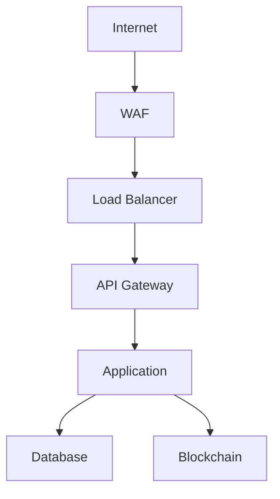
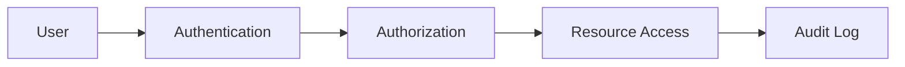

# Security Documentation
---
breadcrumb: [Home](../README.md) > [Technical Documentation](../technical/README.md) > [Security](../technical/security/README.md)
---
This directory contains comprehensive security documentation for the SafeAI platform, including security architecture, best practices, and compliance guidelines.
      
      
## Directory Structure
      
      
### Security Architecture
- [Security Overview](security-overview.md)
- [Authentication](authentication.md)
- [Authorization](authorization.md)
- [Encryption](encryption.md)
      
      
### Compliance
- [Compliance Overview](compliance-overview.md)
- [GDPR Compliance](gdpr-compliance.md)
- [SOC 2 Compliance](soc2-compliance.md)
- [PCI DSS Compliance](pci-compliance.md)
      
      
### Security Operations
- [Security Monitoring](security-monitoring.md)
- [Incident Response](incident-response.md)
- [Vulnerability Management](vulnerability-management.md)
- [Security Testing](security-testing.md)
      
      
### Best Practices
- [Security Guidelines](security-guidelines.md)
- [Secure Development](secure-development.md)
- [Data Protection](data-protection.md)
- [Access Control](access-control.md)
      
      
## Getting Started
      
      
### For Security Engineers
1. Review the [Security Overview](security-overview.md)
2. Study the [Security Architecture](security-architecture.md)
3. Understand the [Compliance Requirements](compliance-overview.md)
      
      
### For Developers
1. Read the [Secure Development](secure-development.md) guide
2. Review the [Security Guidelines](security-guidelines.md)
3. Learn about [Security Testing](security-testing.md)
      
      
### For Compliance Officers
1. Study the [Compliance Overview](compliance-overview.md)
2. Review specific compliance requirements
3. Understand the [Security Controls](security-controls.md)
      
      
## Security Standards
      
      
### Authentication
- Multi-factor Authentication
- Single Sign-On
- Password Policies
- Session Management
      
      
### Authorization
- Role-Based Access Control
- Attribute-Based Access Control
- Permission Management
- Access Reviews
      
      
### Data Protection
- Data Classification
- Encryption Standards
- Data Retention
- Data Privacy
      
      
## Security Controls
      
      
### Network Security

      
      
### Access Control

      
      
## Best Practices
      
      
### Secure Development
- Secure Coding Standards
- Code Review Process
- Security Testing
- Dependency Management
      
      
### Security Operations
- Monitoring and Alerting
- Incident Response
- Vulnerability Scanning
- Penetration Testing
      
      
### Compliance
- Regular Assessments
- Documentation
- Training
- Auditing
      
      
## Support
      
      
### Security Support
- Join the [Security Discord](https://discord.gg/safeai-security)
- Contact security@safeai.com
- Review [Security Policies](security-policies.md)
      
      
### Documentation Issues
- Report issues on GitHub
- Suggest improvements via pull requests
- Contact docs@safeai.com
      
      
---
*Last updated: March 2024*
Copyright © 2024 SafeAI. All rights reserved. 