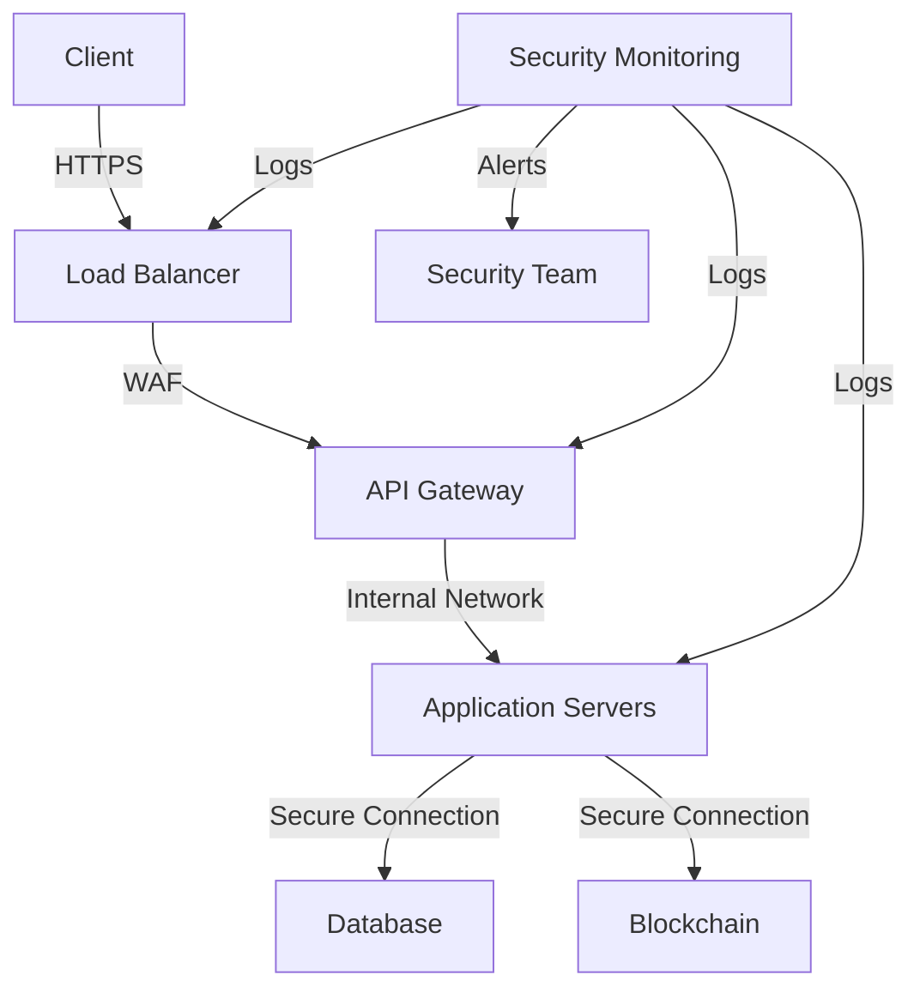
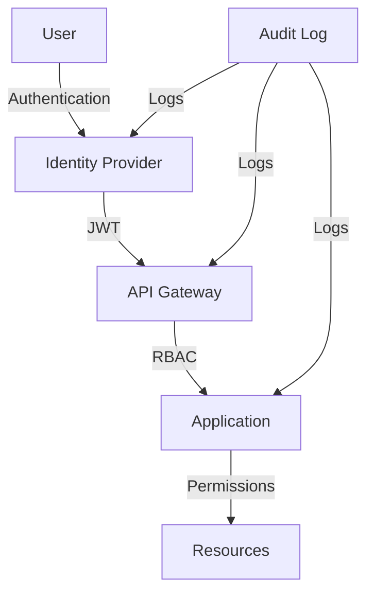

# Security Architecture
---
breadcrumb: [Home](../README.md) > [Technical Documentation](../technical/README.md) > [Security](../technical/security/README.md) > [Security Architecture](../technical/security/security-architecture.md)
---
## Overview
This document outlines the security architecture of the SafeAI platform, including security controls, threat modeling, and security design principles.
## Security Controls
### Network Security

### Access Control

## Threat Modeling
### Threat Categories
1. **Authentication Threats**
   - Brute force attacks
   - Password cracking
   - Session hijacking
   - Token theft
2. **Authorization Threats**
   - Privilege escalation
   - Access control bypass
   - Role manipulation
   - Permission abuse
3. **Data Threats**
   - Data theft
   - Data tampering
   - Data exposure
   - Data loss
4. **Infrastructure Threats**
   - DDoS attacks
   - Network intrusion
   - System compromise
   - Service disruption
### Mitigation Strategies
1. **Authentication Mitigation**
   - Strong password policies
   - Multi-factor authentication
   - Session management
   - Token security
2. **Authorization Mitigation**
   - Role-based access control
   - Permission validation
   - Access logging
   - Regular audits
3. **Data Mitigation**
   - Encryption at rest
   - Encryption in transit
   - Data backup
   - Access controls
4. **Infrastructure Mitigation**
   - DDoS protection
   - Network segmentation
   - System hardening
   - Monitoring
## Security Design Principles
### Defense in Depth
1. **Network Layer**
   - Firewalls
   - IDS/IPS
   - VPN
   - Network monitoring
2. **Application Layer**
   - Input validation
   - Output encoding
   - Error handling
   - Session management
3. **Data Layer**
   - Encryption
   - Access controls
   - Backup
   - Audit logging
### Least Privilege
1. **User Access**
   - Role-based access
   - Permission limits
   - Access reviews
   - Audit trails
2. **System Access**
   - Service accounts
   - Resource limits
   - Network access
   - API access
### Zero Trust
1. **Authentication**
   - Identity verification
   - Device verification
   - Location verification
   - Behavior analysis
2. **Authorization**
   - Access validation
   - Permission checks
   - Context validation
   - Risk assessment
## Security Components
### Identity Management
1. **Authentication**
   - Multi-factor auth
   - Single sign-on
   - Password management
   - Session control
2. **Authorization**
   - Role management
   - Permission management
   - Access control
   - Policy enforcement
### Data Protection
1. **Encryption**
   - Data at rest
   - Data in transit
   - Key management
   - Certificate management
2. **Access Control**
   - Data classification
   - Access policies
   - Audit logging
   - Compliance
### Monitoring
1. **Security Monitoring**
   - Log collection
   - Event analysis
   - Alert management
   - Incident response
2. **Compliance Monitoring**
   - Policy validation
   - Control testing
   - Audit reporting
   - Risk assessment
## Implementation Guidelines
### Security Controls
1. **Network Security**
   - Implement firewalls
   - Configure IDS/IPS
   - Set up VPN
   - Monitor traffic
2. **Application Security**
   - Secure coding
   - Input validation
   - Error handling
   - Session management
3. **Data Security**
   - Encryption
   - Access control
   - Backup
   - Audit logging
### Security Testing
1. **Vulnerability Testing**
   - Regular scans
   - Penetration testing
   - Code review
   - Security assessment
2. **Compliance Testing**
   - Policy validation
   - Control testing
   - Audit review
   - Risk assessment
## Support
For security architecture questions or issues:
- Create an issue in the Security repository
- Contact the Security team at security@safeai.com
- Join the Security development channel in Slack
---
Last Updated: March 2024
© 2024 SafeAI. All rights reserved. 