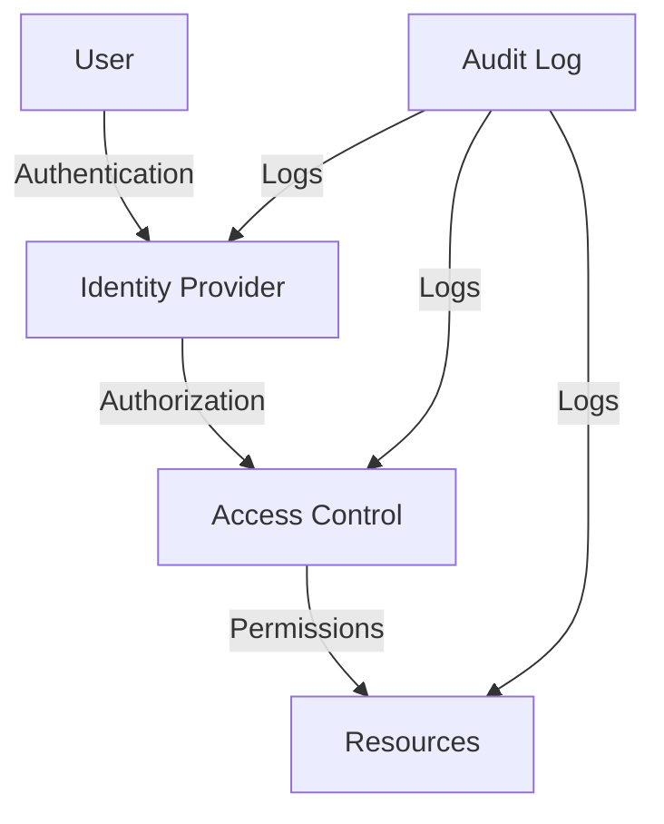
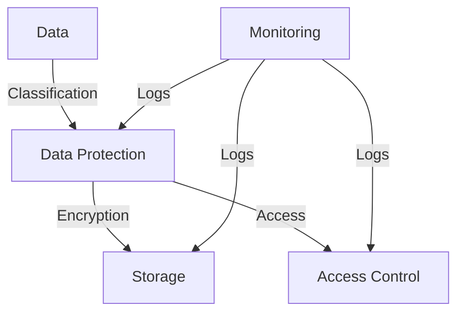

# Security Compliance
---
breadcrumb: [Home](../README.md) > [Technical Documentation](../technical/README.md) > [Security](../technical/security/README.md) > [Security Compliance](../technical/security/security-compliance.md)
---
## Overview
This document outlines the security compliance requirements and implementation for the SafeAI platform, including regulatory requirements, compliance controls, and audit procedures.
## Regulatory Requirements
### Data Protection
1. **GDPR Compliance**
   - Data minimization
   - User consent
   - Data portability
   - Right to erasure
2. **CCPA Compliance**
   - Consumer rights
   - Data collection
   - Data sharing
   - Privacy notices
### Industry Standards
1. **ISO 27001**
   - Information security
   - Risk management
   - Control objectives
   - Audit requirements
2. **SOC 2**
   - Security
   - Availability
   - Processing integrity
   - Confidentiality
   - Privacy
## Compliance Controls
### Access Control

### Data Protection

## Compliance Implementation
### Policy Management
1. **Security Policies**
   - Access control
   - Data protection
   - Incident response
   - Change management
2. **Compliance Policies**
   - Regulatory requirements
   - Industry standards
   - Internal controls
   - Audit procedures
### Control Implementation
1. **Technical Controls**
   - Access management
   - Data encryption
   - Network security
   - Monitoring
2. **Administrative Controls**
   - Policy enforcement
   - Training
   - Documentation
   - Reviews
## Audit Procedures
### Internal Audits
1. **Regular Audits**
   - Policy compliance
   - Control effectiveness
   - Risk assessment
   - Gap analysis
2. **Audit Documentation**
   - Findings
   - Recommendations
   - Action plans
   - Follow-up
### External Audits
1. **Third-party Audits**
   - Independent review
   - Compliance validation
   - Control testing
   - Report generation
2. **Audit Response**
   - Finding resolution
   - Control improvement
   - Documentation
   - Verification
## Compliance Monitoring
### Continuous Monitoring
1. **Control Monitoring**
   - Policy compliance
   - Control effectiveness
   - Risk assessment
   - Incident detection
2. **Performance Monitoring**
   - Metrics tracking
   - Trend analysis
   - Alert management
   - Reporting
### Compliance Reporting
1. **Regular Reports**
   - Status updates
   - Metrics
   - Findings
   - Recommendations
2. **Executive Reports**
   - Risk assessment
   - Compliance status
   - Resource needs
   - Strategic planning
## Implementation Guidelines
### Control Implementation
1. **Technical Controls**
   - Access management
   - Data protection
   - Network security
   - Monitoring
2. **Administrative Controls**
   - Policy management
   - Training
   - Documentation
   - Reviews
### Compliance Testing
1. **Control Testing**
   - Functionality
   - Effectiveness
   - Coverage
   - Documentation
2. **Audit Preparation**
   - Evidence collection
   - Documentation
   - Interview preparation
   - Response planning
## Support
For compliance-related questions or issues:
- Create an issue in the Security repository
- Contact the Compliance team at compliance@safeai.com
- Join the Compliance development channel in Slack
---
Last Updated: March 2024
© 2024 SafeAI. All rights reserved. 