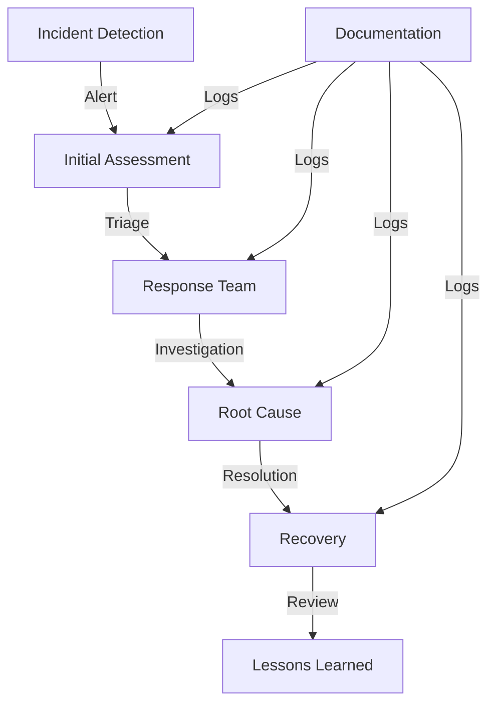
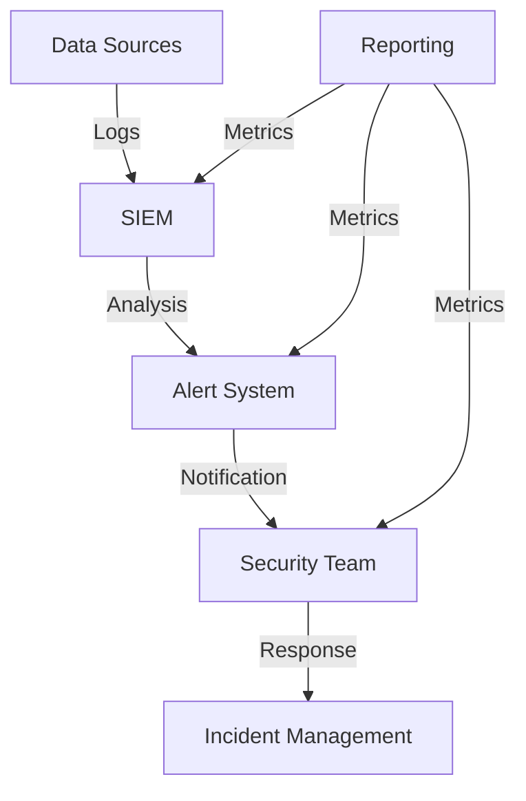

# Security Operations
---
breadcrumb: [Home](../README.md) > [Technical Documentation](../technical/README.md) > [Security](../technical/security/README.md) > [Security Operations](../technical/security/security-operations.md)
---
## Overview
This document outlines the security operations procedures for the SafeAI platform, including incident response, monitoring, and security maintenance.
## Security Operations
### Incident Response

### Security Monitoring

## Incident Response
### Response Procedures
1. **Detection**
   - Alert monitoring
   - Log analysis
   - User reports
   - System alerts
2. **Assessment**
   - Impact analysis
   - Scope determination
   - Risk evaluation
   - Priority setting
3. **Response**
   - Team activation
   - Investigation
   - Containment
   - Resolution
4. **Recovery**
   - System restoration
   - Service recovery
   - Data recovery
   - Verification
### Documentation
1. **Incident Logs**
   - Timeline
   - Actions taken
   - Evidence
   - Communications
2. **Reports**
   - Incident summary
   - Impact analysis
   - Resolution steps
   - Recommendations
## Security Monitoring
### Monitoring Systems
1. **Log Collection**
   - System logs
   - Application logs
   - Security logs
   - Audit logs
2. **Analysis**
   - Pattern detection
   - Anomaly detection
   - Correlation
   - Alert generation
### Alert Management
1. **Alert Processing**
   - Alert triage
   - Priority assessment
   - Assignment
   - Response
2. **Alert Tuning**
   - False positive reduction
   - Threshold adjustment
   - Rule optimization
   - Coverage analysis
## Security Maintenance
### System Updates
1. **Patch Management**
   - Vulnerability scanning
   - Patch testing
   - Deployment
   - Verification
2. **Configuration Management**
   - Baseline configuration
   - Change control
   - Compliance checking
   - Documentation
### Security Testing
1. **Vulnerability Testing**
   - Regular scans
   - Penetration testing
   - Code review
   - Security assessment
2. **Compliance Testing**
   - Policy validation
   - Control testing
   - Audit review
   - Risk assessment
## Operations Procedures
### Daily Operations
1. **Monitoring**
   - Log review
   - Alert checking
   - Performance monitoring
   - Status reporting
2. **Maintenance**
   - System updates
   - Configuration changes
   - Backup verification
   - Health checks
### Emergency Procedures
1. **Incident Response**
   - Team activation
   - Communication
   - Escalation
   - Resolution
2. **Recovery**
   - System restoration
   - Service recovery
   - Data recovery
   - Verification
## Documentation
### Operational Documentation
1. **Procedures**
   - Standard procedures
   - Emergency procedures
   - Maintenance procedures
   - Recovery procedures
2. **Records**
   - Incident records
   - Change records
   - Maintenance records
   - Audit records
### Reporting
1. **Regular Reports**
   - Status updates
   - Metrics
   - Findings
   - Recommendations
2. **Incident Reports**
   - Incident details
   - Response actions
   - Resolution steps
   - Lessons learned
## Support
For security operations questions or issues:
- Create an issue in the Security repository
- Contact the Security Operations team at secops@safeai.com
- Join the Security Operations channel in Slack
---
Last Updated: March 2024
© 2024 SafeAI. All rights reserved. 