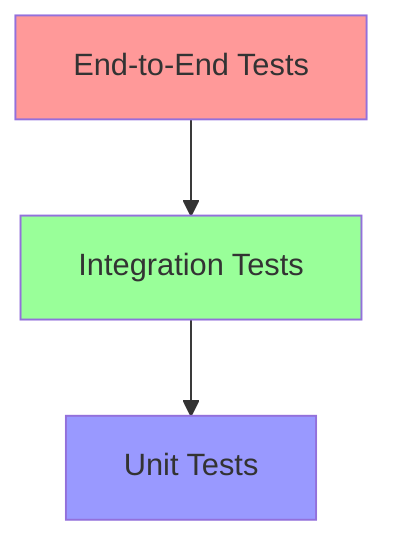

# SafeAI Testing Guide
This guide provides comprehensive testing guidelines and best practices for the SafeAI platform.
## Table of Contents
1. [Testing Strategy](#testing-strategy)
2. [Unit Testing](#unit-testing)
3. [Integration Testing](#integration-testing)
4. [End-to-End Testing](#end-to-end-testing)
5. [Performance Testing](#performance-testing)
6. [Security Testing](#security-testing)
## Testing Strategy
### Testing Pyramid

### Test Coverage Goals
- Unit Tests: 80% coverage
- Integration Tests: 60% coverage
- E2E Tests: Critical paths only
## Unit Testing
### JavaScript/TypeScript
```typescript
// Use Jest for unit testing
import { UserService } from './UserService';

describe('UserService', () => {
  let userService: UserService;

  beforeEach(() => {
    userService = new UserService();
  });

  it('should create a new user', async () => {
    const user = await userService.createUser({
      name: 'John Doe',
      email: 'john@example.com'
    });

    expect(user).toBeDefined();
    expect(user.name).toBe('John Doe');
    expect(user.email).toBe('john@example.com');
  });

  it('should handle validation errors', async () => {
    await expect(
      userService.createUser({
        name: '',
        email: 'invalid-email'
      })
    ).rejects.toThrow('Invalid user data');
  });
});
```
### Python
```python
# Use pytest for unit testing
import pytest
from user_service import UserService

@pytest.fixture
def user_service():
    return UserService()

def test_create_user(user_service):
    user = user_service.create_user({
        'name': 'John Doe',
        'email': 'john@example.com'
    })
    
    assert user is not None
    assert user.name == 'John Doe'
    assert user.email == 'john@example.com'

def test_validation_error(user_service):
    with pytest.raises(ValueError) as exc_info:
        user_service.create_user({
            'name': '',
            'email': 'invalid-email'
        })
    assert str(exc_info.value) == 'Invalid user data'
```
## Integration Testing
### API Testing
```typescript
// Use Supertest for API testing
import request from 'supertest';
import { app } from './app';

describe('User API', () => {
  it('should create a new user', async () => {
    const response = await request(app)
      .post('/api/users')
      .send({
        name: 'John Doe',
        email: 'john@example.com'
      });

    expect(response.status).toBe(201);
    expect(response.body).toHaveProperty('id');
    expect(response.body.name).toBe('John Doe');
  });

  it('should validate user data', async () => {
    const response = await request(app)
      .post('/api/users')
      .send({
        name: '',
        email: 'invalid-email'
      });

    expect(response.status).toBe(400);
    expect(response.body).toHaveProperty('error');
  });
});
```
### Database Testing
```typescript
// Use test database for integration tests
import { Database } from './database';

describe('Database Integration', () => {
  let db: Database;

  beforeAll(async () => {
    db = await Database.connect('test');
  });

  afterAll(async () => {
    await db.disconnect();
  });

  beforeEach(async () => {
    await db.clear();
  });

  it('should persist user data', async () => {
    const user = await db.users.create({
      name: 'John Doe',
      email: 'john@example.com'
    });

    const saved = await db.users.findById(user.id);
    expect(saved).toEqual(user);
  });
});
```
## End-to-End Testing
### Cypress Tests
```typescript
// Use Cypress for E2E testing
describe('User Registration', () => {
  it('should complete registration flow', () => {
    cy.visit('/register');
    
    cy.get('[data-testid="name-input"]').type('John Doe');
    cy.get('[data-testid="email-input"]').type('john@example.com');
    cy.get('[data-testid="submit-button"]').click();
    
    cy.url().should('include', '/dashboard');
    cy.get('[data-testid="welcome-message"]')
      .should('contain', 'Welcome, John Doe');
  });
});
```
### Playwright Tests
```typescript
// Use Playwright for E2E testing
import { test, expect } from '@playwright/test';

test('user registration flow', async ({ page }) => {
  await page.goto('/register');
  
  await page.fill('[data-testid="name-input"]', 'John Doe');
  await page.fill('[data-testid="email-input"]', 'john@example.com');
  await page.click('[data-testid="submit-button"]');
  
  await expect(page).toHaveURL(/.*dashboard/);
  await expect(page.locator('[data-testid="welcome-message"]'))
    .toContainText('Welcome, John Doe');
});
```
## Performance Testing
### Load Testing
```typescript
// Use k6 for load testing
import http from 'k6/http';
import { check, sleep } from 'k6';

export const options = {
  stages: [
    { duration: '30s', target: 20 },
    { duration: '1m', target: 20 },
    { duration: '30s', target: 0 },
  ],
};

export default function () {
  const response = http.get('https://api.safeai.com/users');
  
  check(response, {
    'status is 200': (r) => r.status === 200,
    'response time < 500ms': (r) => r.timings.duration < 500,
  });
  
  sleep(1);
}
```
### Stress Testing
```typescript
// Use Artillery for stress testing
config:
  target: "https://api.safeai.com"
  phases:
    - duration: 60
      arrivalRate: 5
      rampTo: 50
      name: "Ramping up load"
    - duration: 120
      arrivalRate: 50
      name: "Sustained load"
    - duration: 60
      arrivalRate: 0
      rampTo: 0
      name: "Ramping down load"
  variables:
    userId: "123"

scenarios:
  - name: "User operations"
    flow:
      - get:
          url: "/users/{{ userId }}"
      - think: 1
```
## Security Testing
### OWASP Testing
```typescript
// Use OWASP ZAP for security testing
import { zap } from '@zaproxy/zap';

describe('Security Tests', () => {
  it('should prevent SQL injection', async () => {
    const response = await request(app)
      .get('/api/users')
      .query({ id: "' OR '1'='1" });

    expect(response.status).toBe(400);
  });

  it('should prevent XSS attacks', async () => {
    const response = await request(app)
      .post('/api/users')
      .send({
        name: '<script>alert("xss")</script>',
        email: 'test@example.com'
      });

    expect(response.body.name).not.toContain('<script>');
  });
});
```
### Authentication Testing
```typescript
describe('Authentication', () => {
  it('should require valid JWT token', async () => {
    const response = await request(app)
      .get('/api/protected')
      .set('Authorization', 'invalid-token');

    expect(response.status).toBe(401);
  });

  it('should handle token expiration', async () => {
    const response = await request(app)
      .get('/api/protected')
      .set('Authorization', 'expired-token');

    expect(response.status).toBe(401);
    expect(response.body).toHaveProperty('error', 'Token expired');
  });
});
```
## Test Environment Setup
### Docker Compose
```yaml
version: '3'
services:
  test-db:
    image: postgres:13
    environment:
      POSTGRES_DB: safeai_test
      POSTGRES_USER: test
      POSTGRES_PASSWORD: test
    ports:
      - "5432:5432"

  test-redis:
    image: redis:6
    ports:
      - "6379:6379"
```
### Test Configuration
```typescript
// jest.config.js
module.exports = {
  preset: 'ts-jest',
  testEnvironment: 'node',
  setupFiles: ['./test/setup.ts'],
  coverageThreshold: {
    global: {
      branches: 80,
      functions: 80,
      lines: 80,
      statements: 80
    }
  }
};
```
## Resources
- [Jest Documentation](https://jestjs.io/docs/getting-started)
- [Cypress Documentation](https://docs.cypress.io/)
- [Playwright Documentation](https://playwright.dev/docs/intro)
- [k6 Documentation](https://k6.io/docs/)
- [OWASP Testing Guide](https://owasp.org/www-project-web-security-testing-guide/)
---
© 2024 SafeAI. All rights reserved. 