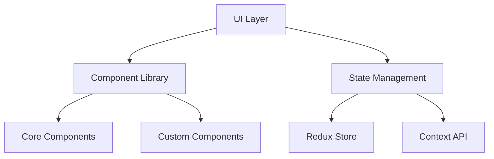

# UI Documentation
---
breadcrumb: [Home](../README.md) > [Technical Documentation](../technical/README.md) > [UI](../technical/ui/README.md)
---

## Overview
This directory contains comprehensive documentation for the SafeAI platform's user interface components, implementation guides, and best practices.

## Directory Structure
```
ui/
├── README.md                 # This file
├── ui-implementation.md      # UI implementation guide
├── ui-components.md         # UI component documentation
├── ui-workflows.md          # UI workflow documentation
└── ui-best-practices.md     # UI development best practices
```

## Getting Started

### For UI Developers
1. Review the [UI Implementation Guide](ui-implementation.md) for core concepts
2. Study [UI Components](ui-components.md) for available components
3. Follow [UI Best Practices](ui-best-practices.md) for development guidelines
4. Reference [UI Workflows](ui-workflows.md) for user interaction patterns

### For Frontend Engineers
1. Start with the [UI Implementation Guide](ui-implementation.md)
2. Review component architecture in [UI Components](ui-components.md)
3. Understand user flows in [UI Workflows](ui-workflows.md)
4. Follow guidelines in [UI Best Practices](ui-best-practices.md)

### For Designers
1. Review [UI Workflows](ui-workflows.md) for user interaction patterns
2. Study [UI Components](ui-components.md) for available design elements
3. Follow [UI Best Practices](ui-best-practices.md) for design guidelines
4. Reference [UI Implementation Guide](ui-implementation.md) for technical constraints

## UI Standards

### Component Architecture


### Design System
- Color Palette
- Typography
- Spacing
- Component Variants
- Animation Guidelines

### Accessibility
- WCAG 2.1 Compliance
- Screen Reader Support
- Keyboard Navigation
- Color Contrast
- Focus Management

## Development Guidelines

### Code Style
```typescript
// Component Structure
import React from 'react';
import { ComponentProps } from './types';

export const Component: React.FC<ComponentProps> = ({
  prop1,
  prop2,
  ...props
}) => {
  // Implementation
};
```

### State Management
```typescript
// Redux Slice Example
const uiSlice = createSlice({
  name: 'ui',
  initialState,
  reducers: {
    // Reducers
  }
});
```

### Performance Optimization
- Code Splitting
- Lazy Loading
- Memoization
- Bundle Optimization
- Image Optimization

## Support
For UI-related questions or issues:
- Create an issue in the UI repository
- Contact the UI team at ui@safeai.com
- Join the UI development channel in Slack

## Contributing
1. Follow the UI development guidelines
2. Write tests for new components
3. Update documentation
4. Submit pull requests for review

---
Last Updated: March 2024
© 2024 SafeAI. All rights reserved. 