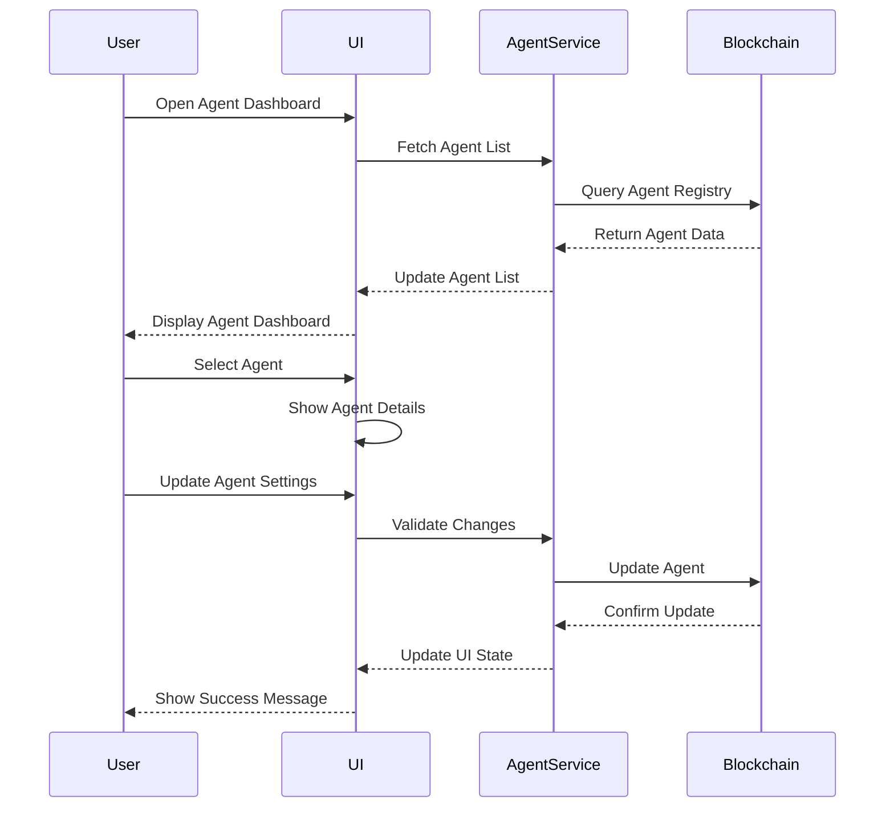
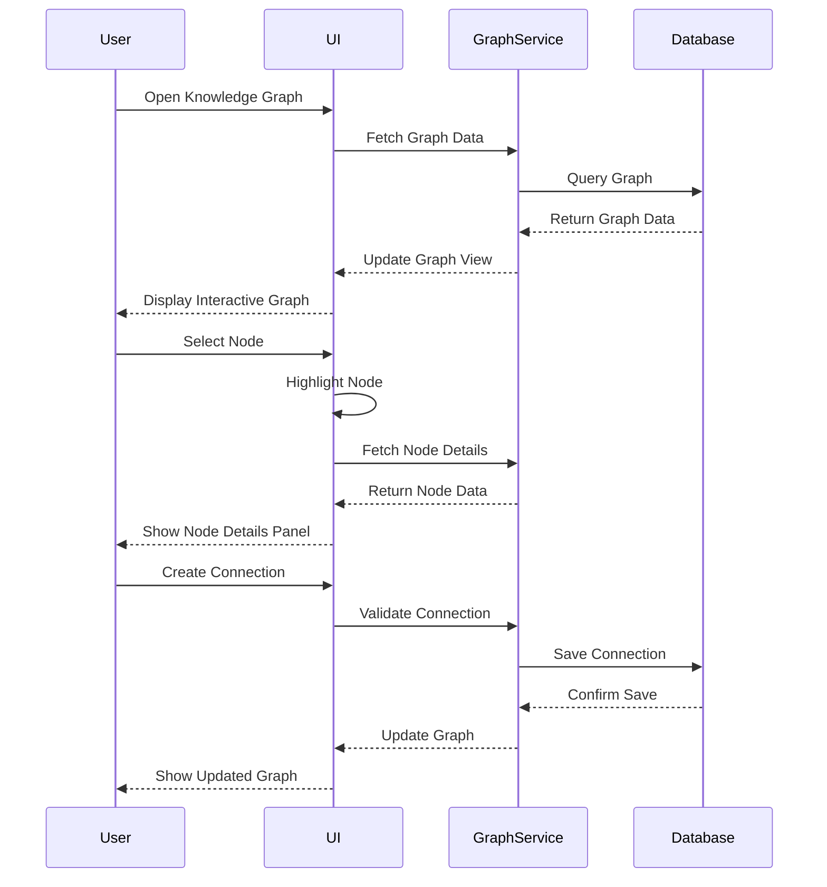
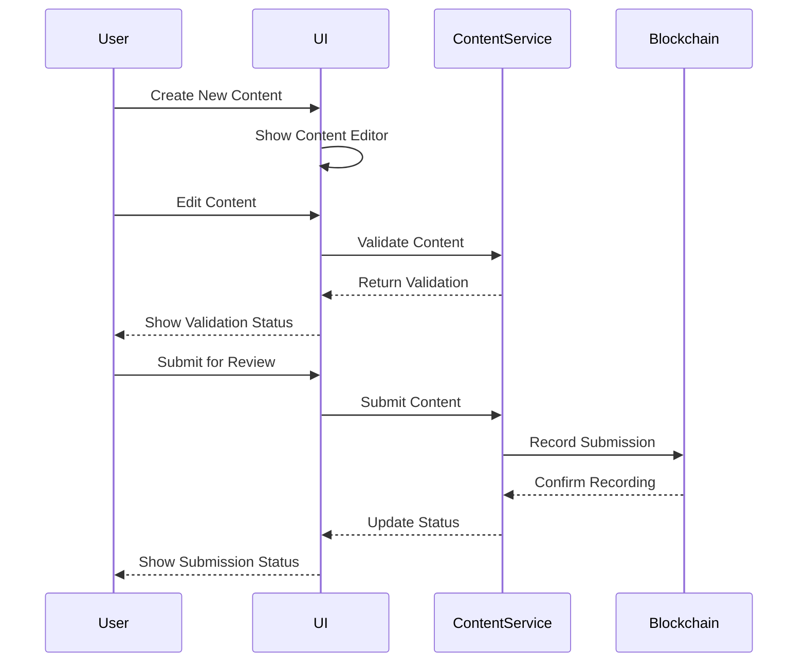

# UI Workflows Documentation
---
breadcrumb: [Home](../README.md) > [Technical Documentation](../technical/README.md) > [UI](../technical/ui/README.md) > [UI Workflows](../technical/ui/ui-workflows.md)
---


## Overview
This document outlines the key user workflows and interaction patterns in the SafeAI platform, providing detailed guidance for implementation and user experience.
## Core Workflows

### Agent Management


#### Implementation
```typescript
// Agent Management Workflow
const handleAgentManagement = async () => {
  try {
    // Fetch agent list
    const agents = await agentService.getAgents();
    
    // Display agent dashboard
    setAgentDashboard(agents);
    
    // Handle agent selection
    const handleAgentSelect = (agent: Agent) => {
      setSelectedAgent(agent);
      showAgentDetails(agent);
    };
    
    // Handle agent updates
    const handleAgentUpdate = async (agent: Agent) => {
      await agentService.updateAgent(agent);
      showSuccessMessage('Agent updated successfully');
    };
  } catch (error) {
    handleError(error);
  }
};
```

### Knowledge Graph Interaction


#### Implementation
```typescript
// Knowledge Graph Workflow
const handleKnowledgeGraph = async () => {
  try {
    // Initialize graph
    const graphData = await graphService.getGraphData();
    setGraphView(graphData);
    
    // Handle node selection
    const handleNodeSelect = async (node: GraphNode) => {
      const nodeDetails = await graphService.getNodeDetails(node.id);
      showNodeDetailsPanel(nodeDetails);
    };
    
    // Handle connection creation
    const handleConnectionCreate = async (connection: Connection) => {
      await graphService.createConnection(connection);
      updateGraphView();
    };
  } catch (error) {
    handleError(error);
  }
};
```

### Content Publishing


#### Implementation
```typescript
// Content Publishing Workflow
const handleContentPublishing = async () => {
  try {
    // Initialize content editor
    const content = await contentService.initializeContent();
    setContentEditor(content);
    
    // Handle content validation
    const handleContentValidation = async (content: Content) => {
      const validation = await contentService.validateContent(content);
      updateValidationStatus(validation);
    };
    
    // Handle content submission
    const handleContentSubmit = async (content: Content) => {
      await contentService.submitContent(content);
      showSubmissionStatus('Content submitted successfully');
    };
  } catch (error) {
    handleError(error);
  }
};
```

## User Experience Guidelines

### Navigation Patterns
1. **Breadcrumb Navigation**
   - Always show current location
   - Provide quick access to parent pages
   - Maintain consistent hierarchy

2. **Tab Navigation**
   - Group related content
   - Show active state clearly
   - Support keyboard navigation

3. **Modal Dialogs**
   - Use for focused actions
   - Provide clear exit options
   - Maintain context

### Feedback Patterns
1. **Loading States**
   - Show progress indicators
   - Disable interactive elements
   - Provide cancel options

2. **Success Messages**
   - Be concise and clear
   - Auto-dismiss after action
   - Provide undo options

3. **Error Handling**
   - Show specific error messages
   - Provide recovery options
   - Log errors for debugging

### Form Patterns
1. **Input Validation**
   - Validate in real-time
   - Show clear error messages
   - Prevent invalid submission

2. **Auto-save**
   - Save changes periodically
   - Show save status
   - Handle conflicts

3. **Multi-step Forms**
   - Show progress
   - Allow navigation between steps
   - Validate each step

## Accessibility Guidelines

### Keyboard Navigation
1. **Focus Management**
   - Maintain logical tab order
   - Show focus indicators
   - Handle focus trapping

2. **Shortcuts**
   - Provide keyboard shortcuts
   - Show shortcut hints
   - Allow customization

### Screen Reader Support
1. **ARIA Labels**
   - Use semantic elements
   - Provide descriptive labels
   - Update live regions

2. **Alternative Text**
   - Describe images
   - Provide text alternatives
   - Handle dynamic content

## Performance Guidelines

### Loading Optimization
1. **Lazy Loading**
   - Load components on demand
   - Show loading states
   - Handle errors gracefully

2. **Caching**
   - Cache frequently used data
   - Update cache strategically
   - Handle stale data

### State Management
1. **Redux Store**
   - Organize state logically
   - Handle side effects
   - Optimize updates

2. **Local State**
   - Use appropriate scope
   - Handle state updates
   - Clean up resources

## Support
For workflow-related questions or issues:
- Create an issue in the UI repository
- Contact the UI team at ui@safeai.com
- Join the UI development channel in Slack

---
Last Updated: March 2024
© 2024 SafeAI. All rights reserved. 