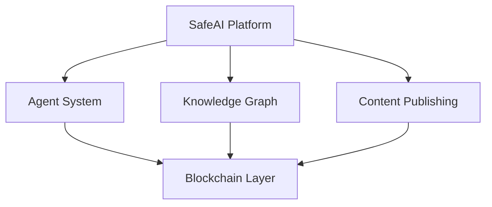
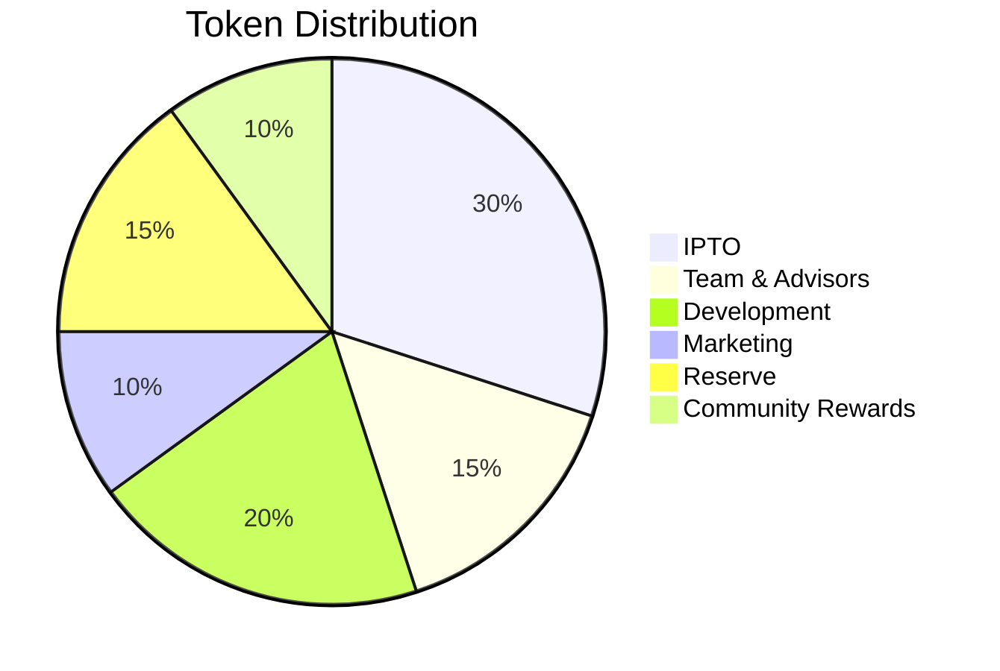

# SafeAI Whitepaper
## Executive Summary
SafeAI is a decentralized platform that revolutionizes artificial intelligence through blockchain technology, ensuring transparency, accountability, and ethical AI development. Our platform enables the creation and management of AI agents, knowledge graphs, and content publishing with built-in blockchain verification.

## Table of Contents
1. [Introduction](#introduction)
2. [Problem Statement](#problem-statement)
3. [Solution](#solution)
4. [Technology](#technology)
5. [Token Economics](#token-economics)
6. [Use Cases](#use-cases)
7. [Roadmap](#roadmap)
8. [Team](#team)
9. [Risk Factors](#risk-factors)

## Introduction

### Vision
SafeAI aims to create a transparent, accountable, and ethical AI ecosystem where AI agents can be developed, deployed, and monitored with full blockchain verification.

### Mission
To democratize AI development while ensuring transparency, accountability, and ethical standards through blockchain technology.

## Problem Statement

### Current Challenges
1. **Lack of Transparency**
   - Opaque AI decision-making
   - Unclear data usage
   - Limited accountability

2. **Ethical Concerns**
   - Bias in AI systems
   - Privacy violations
   - Unethical AI applications

3. **Technical Barriers**
   - Complex AI development
   - Limited accessibility
   - High resource requirements

## Solution

### SafeAI Platform
1. **Agent System**
   - Prompt-based agents
   - Script-based agents
   - Hybrid capabilities

2. **Knowledge Graph**
   - Structured data representation
   - Relationship mapping
   - Query optimization

3. **Content Publishing**
   - Blockchain verification
   - License management
   - Distribution tracking

### Key Features
1. **Transparency**
   - Blockchain verification
   - Audit trails
   - Public records

2. **Security**
   - Multi-layer protection
   - Access control
   - Data encryption

3. **Scalability**
   - Distributed architecture
   - Resource optimization
   - Performance monitoring

## Technology

### Architecture

### Core Components
1. **Agent System**
   - Natural language processing
   - Code execution
   - Resource management

2. **Knowledge Graph**
   - Graph database
   - Query engine
   - Data validation

3. **Blockchain Integration**
   - Smart contracts
   - Token management
   - Transaction verification

### Technical Specifications
1. **Platform Requirements**
   - Node.js v14+
   - Python 3.8+
   - Ethereum compatibility

2. **Smart Contracts**
   - ERC-20 token
   - Multi-signature
   - Time-locking

3. **Security Measures**
   - Encryption
   - Authentication
   - Authorization

## Token Economics

### Token Details
- **Name**: SafeAI Token (SAFE)
- **Type**: ERC-20
- **Total Supply**: 1,000,000,000
- **Decimals**: 18
- **Network**: Ethereum Mainnet

### Distribution

### Utility
1. **Platform Usage**
   - Agent creation
   - Knowledge graph access
   - Content publishing

2. **Governance**
   - Voting rights
   - Proposal creation
   - Parameter adjustment

3. **Rewards**
   - Staking rewards
   - Contribution incentives
   - Community benefits

## Use Cases

### AI Development
1. **Agent Creation**
   - Custom AI agents
   - Specialized capabilities
   - Resource allocation

2. **Knowledge Management**
   - Data organization
   - Relationship mapping
   - Query optimization

3. **Content Publishing**
   - AI-generated content
   - License management
   - Distribution tracking

### Industry Applications
1. **Healthcare**
   - Medical diagnosis
   - Drug discovery
   - Patient care

2. **Finance**
   - Risk assessment
   - Fraud detection
   - Trading strategies

3. **Education**
   - Personalized learning
   - Content creation
   - Assessment tools

## Roadmap

### Phase 1: Foundation (Q1-Q2 2024)
- Platform development
- Core features
- Security implementation

### Phase 2: Growth (Q3-Q4 2024)
- Feature expansion
- Partnership development
- Community building

### Phase 3: Scale (2025)
- Global expansion
- Advanced features
- Enterprise adoption

## Team

### Core Team
- **CEO**: [Name]
- **CTO**: [Name]
- **Head of AI**: [Name]
- **Head of Blockchain**: [Name]

### Advisors
- **AI Expert**: [Name]
- **Blockchain Expert**: [Name]
- **Legal Advisor**: [Name]
- **Business Advisor**: [Name]

## Risk Factors

### Technical Risks
1. **Smart Contract**
   - Vulnerabilities
   - Upgrades
   - Integration

2. **Platform**
   - Performance
   - Scalability
   - Security

### Market Risks
1. **Token**
   - Volatility
   - Liquidity
   - Adoption

2. **Competition**
   - Market changes
   - New entrants
   - Technology shifts

### Regulatory Risks
1. **Compliance**
   - Regulations
   - Laws
   - Policies

2. **Legal**
   - Litigation
   - Claims
   - Disputes

## Conclusion
SafeAI represents a significant step forward in the development of transparent, accountable, and ethical AI systems. Through blockchain technology and innovative architecture, we aim to create a platform that democratizes AI development while ensuring the highest standards of transparency and accountability.

## Resources
- [Technical Documentation](../technical/README.md)
- [Legal Documents](../legal/README.md)
- [Security Guidelines](../security/README.md)
- [Community Guidelines](../community/README.md)

---
© 2024 SafeAI. All rights reserved. 